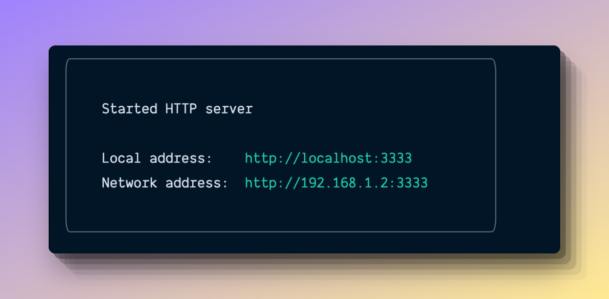

# CLI UI

> Command line UI Kit used by AdonisJS

This repo is a command line UI Kit used by the AdonisJS framework to design its command line interfaces.

The kit is highly opinionated and we will not allow configurable settings in the near future. We want to be consistent with our UI's without worrying about the configuration.

[![gh-workflow-image]][gh-workflow-url] [![typescript-image]][typescript-url] [![npm-image]][npm-url] [![license-image]][license-url] [![synk-image]][synk-url]

<!-- START doctoc generated TOC please keep comment here to allow auto update -->
<!-- DON'T EDIT THIS SECTION, INSTEAD RE-RUN doctoc TO UPDATE -->
## Table of contents

- [Installation](#installation)
- [Usage](#usage)
- [Logger](#logger)
    - [`success(message, prefix?, suffix?)`](#successmessage-prefix-suffix)
  - [`error(message, prefix?, suffix?)`](#errormessage-prefix-suffix)
  - [`fatal(message, prefix?, suffix?)`](#fatalmessage-prefix-suffix)
  - [`warning(message, prefix?, suffix?)`](#warningmessage-prefix-suffix)
  - [`info(message, prefix?, suffix?)`](#infomessage-prefix-suffix)
  - [`debug(message, prefix?, suffix?)`](#debugmessage-prefix-suffix)
  - [`log(message)`](#logmessage)
  - [`logError(message)`](#logerrormessage)
  - [`logUpdate(message)`](#logupdatemessage)
- [Action](#action)
  - [`action.succeeded(message)`](#actionsucceededmessage)
  - [`action.‌skipped(message)`](#action%E2%80%8Cskippedmessage)
  - [`action.failed(message, errorMessage)`](#actionfailedmessage-errormessage)
- [Instructions](#instructions)
- [Sticker](#sticker)
- [Tasks](#tasks)
  - [Task Renderers](#task-renderers)
  - [Running tasks](#running-tasks)
  - [Verbose renderer](#verbose-renderer)

<!-- END doctoc generated TOC please keep comment here to allow auto update -->

## Installation

Install the package from the npm registry by running following command.

```sh
npm i @poppinss/cliui

# Yarn users
yarn add @poppinss/cliui
```

## Usage

Import the components you want to use from the package.

```ts
import { logger, instructions, sticker, tasks, table } from '@poppinss/cliui'
```

```ts
logger.info('hello world')

const spinner = logger.await('downloading')

await someTimeConsumingTask()
spinner.stop()
```

## Logger


The logger exposes the following methods.

#### `success(message, prefix?, suffix?)`

Log success message. The message is printed to `stdout`.

```ts
logger.success('Account created')

// [ success ]  Account created
```

Optional prefix

```ts
logger.success('Account created', 'ap-south-1')

// [ap-south-1] [ success ]  Account created
```

Optional suffix

```ts
logger.success('Account created', undefined, 'ap-south-1')

// [ success ]  Account created (ap-south-1)
```

> The prefix and suffix are support on all logger methods except `logger.action`

### `error(message, prefix?, suffix?)`

Log an error message. The message is printed to `stderr`.

```ts
logger.error('Unable to write. Disk full')

// Or log error object
logger.error(new Error('Unable to write. Disk full'))

// [ error ]  Unable to write. Disk full
```

### `fatal(message, prefix?, suffix?)`

The `logger.error` does not print the error stack. You must use `logger.fatal` to print the error stack.

```ts
logger.fatal(new Error('Unable to write. Disk full'))
```


### `warning(message, prefix?, suffix?)`

Print a warning message. Message is written to `stdout`.

```ts
logger.warning('Running out of disk space')

// [ warn ]  Running out of disk space
```

### `info(message, prefix?, suffix?)`

Print an info message. Message is again written to `stdout`.

```ts
logger.info('Your account is has been updated')

// [ info ]  Your account is has been updated
```

### `debug(message, prefix?, suffix?)`

Print a debug message. Message is printed to `stdout`.

```ts
logger.debug('Something just happened')

// [ debug ]  Something just happened
```

### `log(message)`

Similar to `console.log`, but instead uses the Logger renderer.

> We will talk about renderers later in this document, since they make testing of log message little bit easier.

```ts
logger.log('hello world')
```

### `logError(message)`

Similar to `console.error`, but instead use the Logger renderer.

```ts
log.logError('this is an error message')
```

### `logUpdate(message)`

Log a message that overwrites the previously logged message. The method is helpful for building progress bars or animations.

```ts
logger.logUpdate(`downloading ${i}%`)

// Once completed, persist the message on console
logger.logUpdatePersist()
```

Here is a complete example of showing the downloading progress.

```ts
const sleep = () => new Promise((resolve) => setTimeout(resolve, 50))

async function run() {
  for (let i = 0; i <= 100; i = i + 2) {
    await sleep()
    logger.logUpdate(`downloading ${i}%`)
  }

  logger.logUpdatePersist()
}

run()
```


## Action


In order to log results of an action/task, we make use of the `action` method.

```ts
const action = logger.action('create')
action.succeeded('config/auth.ts')
```

An action can end in one of the following states.

### `action.succeeded(message)`

Action completed successfully

```ts
const action = logger.action('create')
action.succeeded('config/auth.ts')
```

### `action.‌skipped(message)`

Skipped action

```ts
const action = logger.action('create')
action.skipped('app/Models/User.ts')
```

### `action.failed(message, errorMessage)`

Action failed, an error message is required to share more context

```ts
const action = logger.action('create')
action.failed('server.ts', 'File already exists')
```

## Instructions


Instructions are mainly the steps we want someone to perform in order to achieve something. For example:

- Display instructions to start the development
- Or display instructions to bundle the code for production

```ts
import { instructions, logger } from '@poppinss/cliui'

instructions()
  .add(`cd ${logger.colors.cyan('hello-world')}`)
  .add(`Run ${logger.colors.cyan('node ace serve --watch')} to start the server`)
  .render()
```

- Calling the `instructions()` begins a new instructions block
- Next, you can add new lines by using the `.add()` method.
- Finally, call the `render()` method to render it on the console.

## Sticker



Similar to the **instructions**, but a sticker does not prefix the lines with a pointer `>` arrow. Rest is all same.

It is helpful for displaying a message that needs the most attention. For example:

- Update the CLI version
- Or, the address to access the local server

```ts
import { sticker, logger } from '@poppinss/cliui'

sticker()
  .add('Started HTTP server')
  .add('')
  .add(`Local address:    ${logger.colors.cyan('http://localhost:3333')}`)
  .add(`Network address:  ${logger.colors.cyan('http://localhost:3333')}`)
  .render()
```

## Tasks

We make use of tasks when performing multiple actions in respond to a command. For example:

- Create a new AdonisJS app
- Or, Setup packages after installation

The UI for the tasks is designed to only handle tasks running in sequence.

### Task Renderers

Task has two renderers `minimal` and `verbose`. The minimal renderer is the default choice and switch to `verbose` in one of the following situations.

- Command line is not interactive (no tty)
- Or someone has explicitly opted for verbose output.

### Running tasks

Following is a very simple example of creating and running multiple tasks.

```ts
import { tasks } from '@poppinss/cliui'

await tasks()
  .add('clone repo', async (logger, task) => {
    logger.info(`cloning ${someRepoUrl}`)

    await performClone()
    await task.complete()
  })
  .add('install dependencies', async (logger, task) => {
    const spinner = logger.await('running npm install')

    await performInstall()
    spinner.stop()

    await task.complete()
  })
  .run()
```

- The `add` method accepts the **task title** and the callback function to invoke in order to perform the task
- Once, you are done with the task jobs, you must call `await task.complete()` to complete the task. The `await` is important here.
- In order to **mark task as failed**, you can call the `task.fail` method. All upcoming tasks will be stopped in case of a failure.
  `ts await task.fail(new Error('Network error'))`

By default, the `minimal` renderer is used and pivots to the verbose renderer only when terminal is not interactive.


### Verbose renderer

In order to run tasks explicitly in the verbose mode, you can create the tasks instance using `tasks.verbose()` method.

```ts
tasks.verbose().add().add().run()
```


[gh-workflow-image]: https://img.shields.io/github/workflow/status/poppinss/cliui/test?style=for-the-badge
[gh-workflow-url]: https://github.com/poppinss/cliui/actions/workflows/test.yml "Github action"

[typescript-image]: https://img.shields.io/badge/Typescript-294E80.svg?style=for-the-badge&logo=typescript
[typescript-url]: "typescript"

[npm-image]: https://img.shields.io/npm/v/@poppinss/cliui.svg?style=for-the-badge&logo=npm
[npm-url]: https://npmjs.org/package/@poppinss/cliui 'npm'

[license-image]: https://img.shields.io/npm/l/@poppinss/cliui?color=blueviolet&style=for-the-badge
[license-url]: LICENSE.md 'license'

[synk-image]: https://img.shields.io/snyk/vulnerabilities/github/poppinss/cliui?label=Synk%20Vulnerabilities&style=for-the-badge
[synk-url]: https://snyk.io/test/github/poppinss/cliui?targetFile=package.json 'synk'
